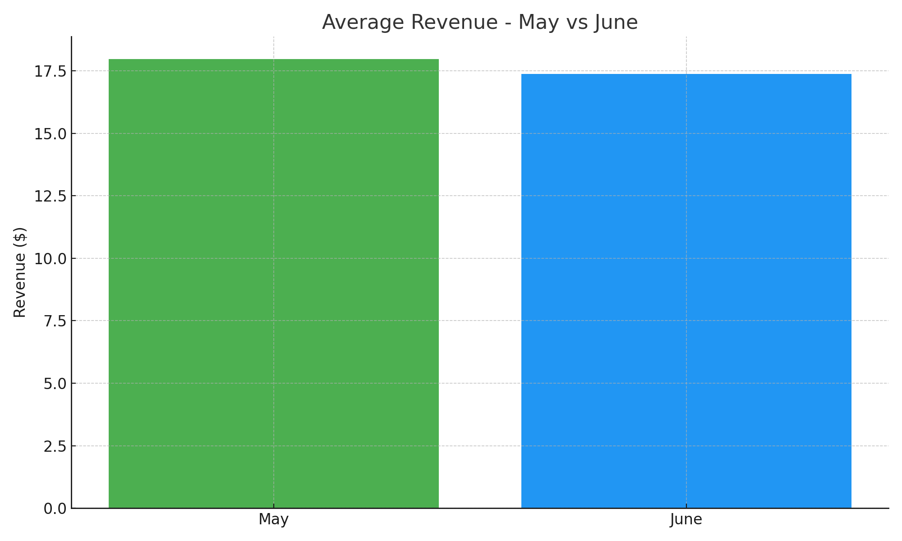
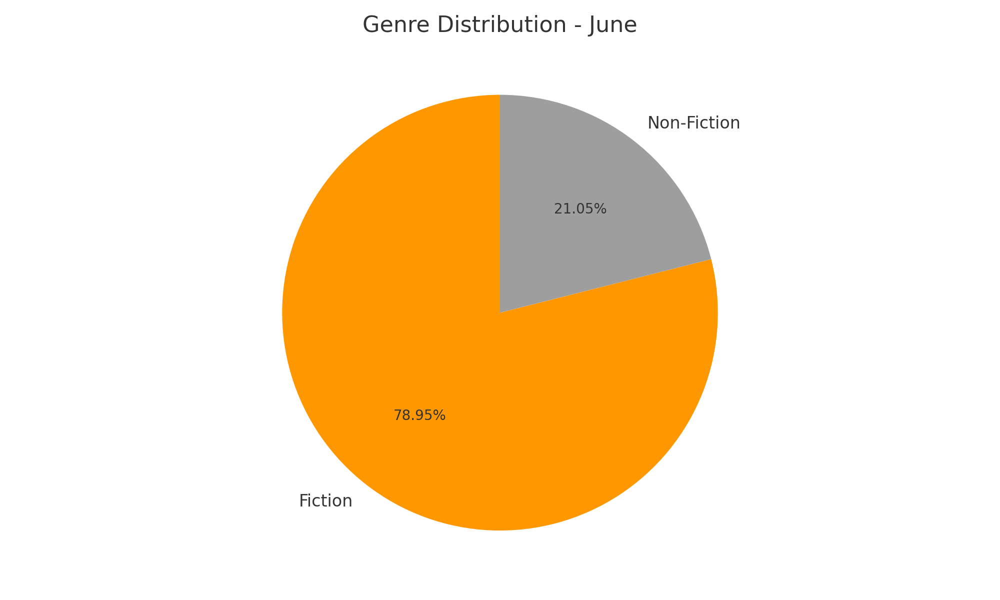
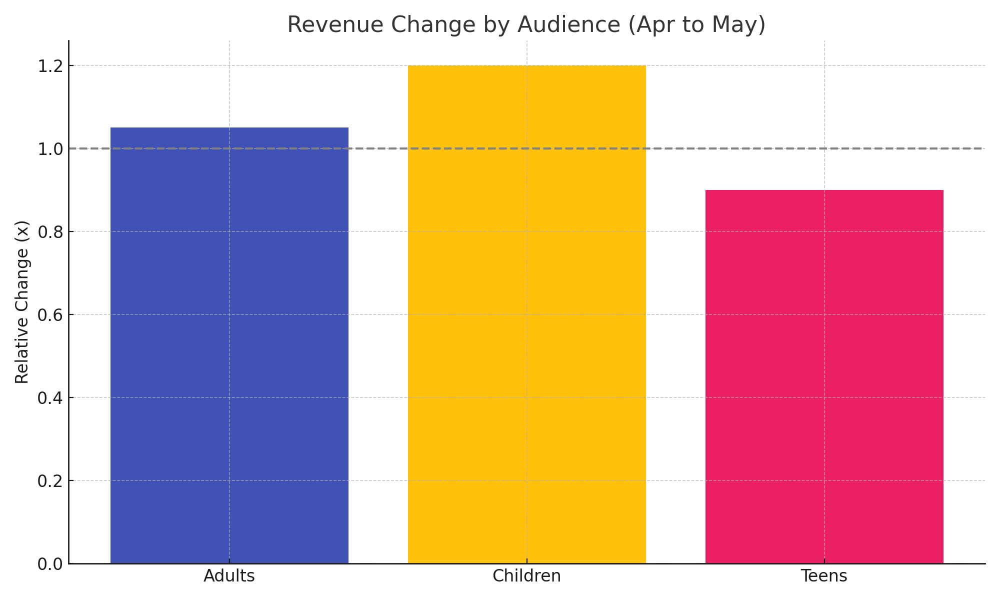
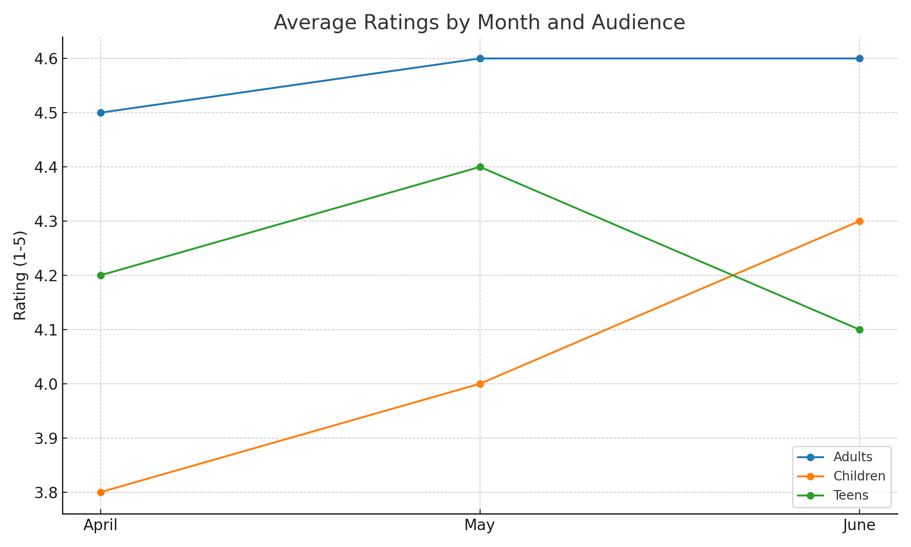

# Book Stores’ Performance Ana
## 📌 Introduction
This project analyzes book sales performance for Q2 2023, focusing on sales revenue, genre preferences, audience segmentation, and customer ratings.  
The dataset contains transactions for April, May, and June 2023.

---

## 🛠 Technologies
- **Python**: Data processing and analysis  
- **Pandas**: Data manipulation  
- **Matplotlib / Seaborn**: Data visualization  
- **Jupyter / Colab**: Development environment  

---

## 📊 Analysis Summary

### 1. Sales Revenue – May vs. June
- May average revenue: **$17.98**  
- June average revenue: **$17.37**  
- Change: **↓ 3.4%**, indicating stable performance.  



---

### 2. Genre Distribution – June
- Fiction: **78.95%** of total sales  
- Non-Fiction: **21.05%**



---

### 3. Top Revenue by Audience (April & May)
- Adults: Highest revenue (+5%)  
- Children: Lowest revenue but grew by 20%  
- Teens: Slight decline (-10%) but still second place  



---

### 4. Average Ratings by Month & Audience
- Adults’ books: Consistently highest ratings  
- Children’s books: Lowest in April but improved in June  
- Teens’ books: Decrease in June after an increase in May  



---

## 📈 Key Insights
- **Fiction dominates** sales in June  
- **Adults** remain the most valuable segment  
- **Revenue is stable**, with a slight dip in June  
- **Children’s books** are showing growth potential in ratings and revenue  

---

## 🚀 How to Run
  1. Clone this repository:
   ```bash
   git clone https://github.com/<your-username>/<your-repo>.git
   cd <your-repo>

	2.	Install dependencies:

  pip install pandas matplotlib seaborn


	3.	Run the analysis:

  python data_visualization.py


⸻

📜 License

This project is for academic purposes.

